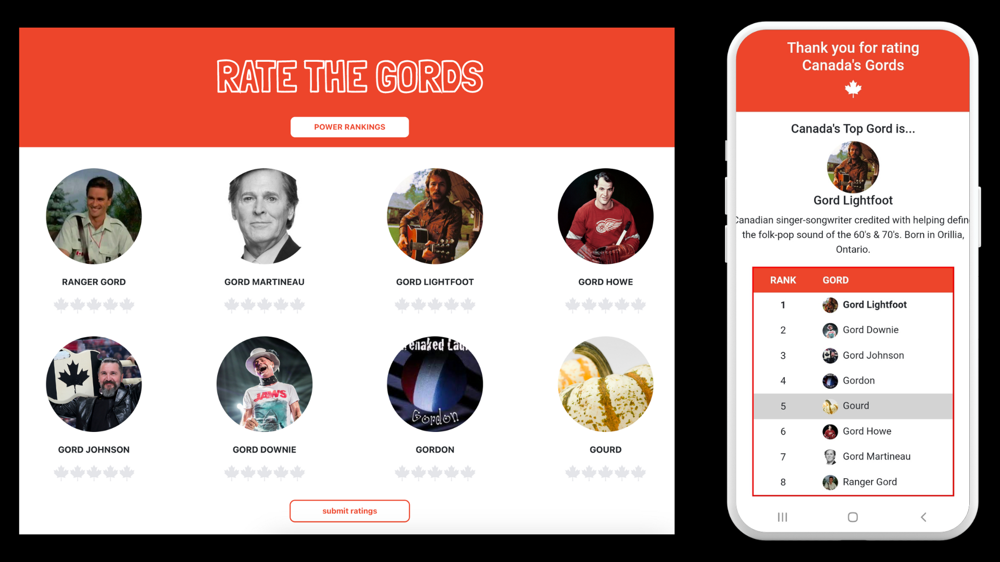

 

# Rate The Gords:

## Table of contents

- [Description](#Description)
- [Technologies](#Technologies)
- [Usage-Installation](#Usage-Installation)
- [Demo](#Demo)
- [Credits](#credits)

## Description

Canada has a lot of iconic Gords and this is the site where you can rate them.

Rate The Gord users can submit their own Gord Ratings (on a scale of 1 - 5 maple leafs). Not sure who a Gord is? Hover over their image to see a quick bio explaining why they are an iconic Gord. Power rankings are available on the home page and after rating submission so you can always see who is Canada's current top-rate Gord.

Rate The Gords is a responsive and mobile-friendly MERN stack application.

## Technologies

This Project was built using:

- MongoDB
- Mongoose
- Node.js
- Express.js
- React.js
- JavaScript & JSX
- Bootstrap
- CSS

## Usage-Installation

To use this site, visit [www.ratethegords.ca](http://www.ratethegords.ca)

## Credits

Built and Designed by Amy Wilford
